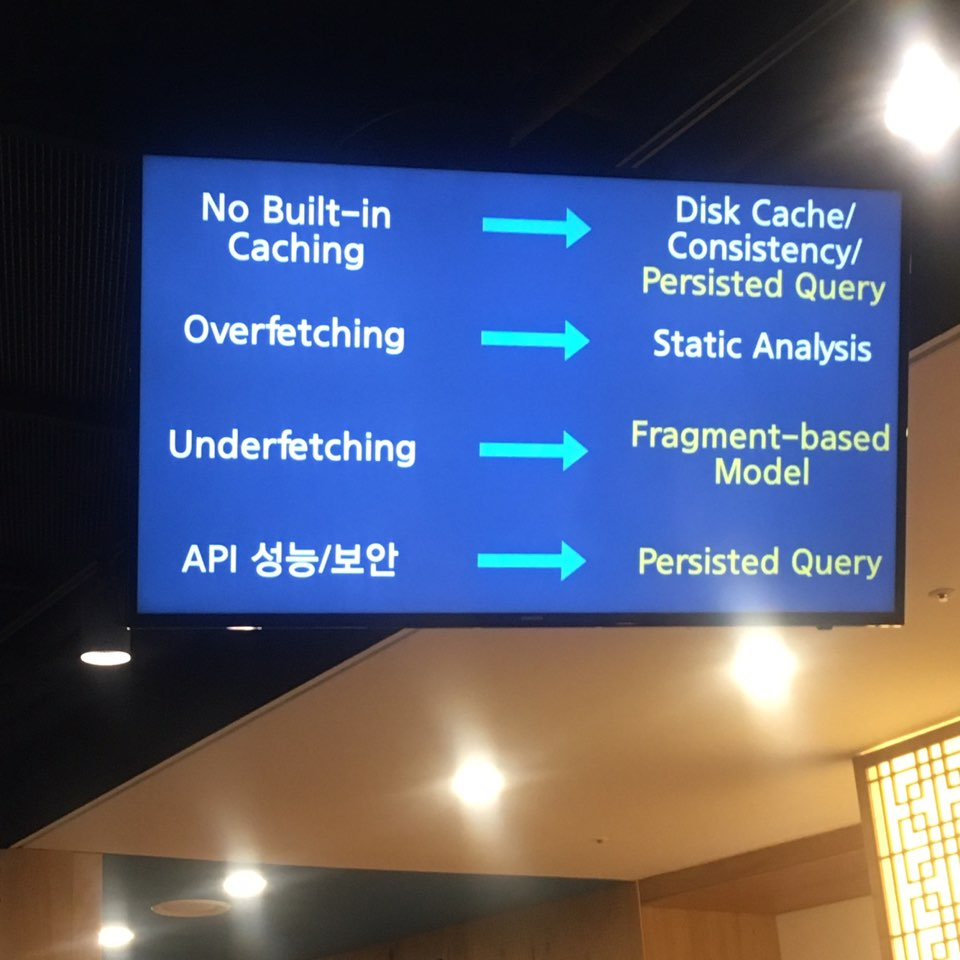

# Facebook graphQL

Graphql 에서 어떤 것인지 어떻게 활용할것인지 알아보자

페이스북 엔지니어 정효현

Asiandrummer

처음 들어갔을 때 graphql 팀에 들어가서 오픈소스 관련해서 tool에 관해서만 개발을 하고 있다.

React relay graphQL 이 세가지를 개발 로직을 가지고 있다.

relay는 연결해주는 react와 graphql을 연결해주는 것이다.

Facebook 2003년부터 mobile을 신경쓰기 시ㅈ각햇다.

기존적인 웹환경에서 모바일이 등장해서 웹 브라우저에 Native app을 넣어서 보여줬다.

너무 느렸등ㅁ=> web First에서 Mobile First로 생각을 바꾸기 시작함.

맨위를 Native App으로 싹 바꾸어 버림

웹에서는 restAPI가 굉장히 좋다. 하지만 모바일에서는 굉장히 힘들었다.

데이터를 생각할 때 Join-tables로 생각하지 않는다. 관계가 많는 데이터가 하이얼 article하게 있으면 관계가 깊다.

저장하는 저장공간이 아니고 불러오는 언어이다.

Subscribeupdate = 실시간으로 graphql의 변화를 알수 있는 api

conntecti이란 컨셉이 또 있다. 관계에 집중을 한 컨셉 edge 등

중심 디자인 => 어떻게 하면 프로덕트 개발자와 리스폰을 보면은 이런 쿼리를 디자인하면 서로 협업이 가능하다.

모양 = Type임. graphql은 강타입이다. Strong type 모든 애들이 잘되잇따.

ssr에서 집합체라고생각하면 된다.

fragemnt를 사용해서 불러오기를 한다.

그래프 ql은 capability 와 requirement로 상호 데이터 교환한다.

우리는 어떻게 씀?

그냥 저희도잘 모른다? graphql을 쓰끼 위해서 이해하게 만들겟다. 그냥 얹기만 하면 작동할 수 있다.

## Type System On Client

graphQL query를 서버에 보내면 서버가 알고 있는 데이터 shape 다 보내줌 tool을 많은 platform으로 제공을 해줌

## Mutation

Read n write

rest는 post delete가 바꾸는 api인데 스펙상으로 데이터를 가져오지 않게 되있음 액션취하고 get을 취함

Mutation 한번 갔다가 데이터 바꾸고 바뀐 데이터를 가져옴.

- 어떻게 하면 모바일에서 한번 보내놓고 기다리고 효율적으로 데이터를 받을수잇ㅇ르까?에서 시작함

페이스북에서 어떻게 사용하고 있는지 애기를 안해줌.

Vaildate 확인을 한번해준다.

NO built-in caching =>
Overmatching


Client-side GraphQl introspection

Query = class 로 function = field로 생각하면 편하다.

Type based보다 fragment-based가 훨씬 효율적이다.

## realtime - graphQL

실시간으로 알림이 변하는 모습을 구현함

## Relay = react와 graphql을 연결해줌
